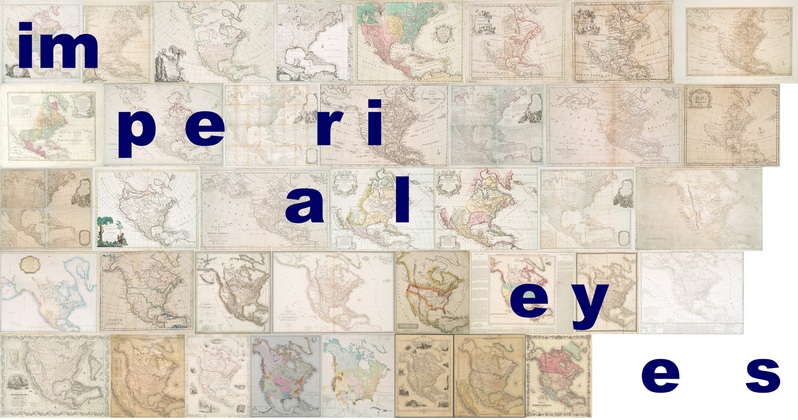

## Supporting Materials
* * *

### Cellular Network Infrastructure Digital Story

<iframe src="https://player.vimeo.com/video/261676655" width="640" height="360" frameborder="0" webkitallowfullscreen mozallowfullscreen allowfullscreen></iframe>

Created for Miraim Posner's *Systems and Infrastrucutres* course in Winter 2018, this digital story investigates the history and emergence of physcial cellular network infrastructure in the United States. Part of a larger, quarter-long project on this topic, this short video was also accompanied by a series of essays on related topics. Having little prior experience in creating moving image or time based media, I include a link here to illustrate the varied skills developed through my core course work and to demonstrate my ability to work and adapt to a wider range of media formats. 

* * *

### Imperial Eyes

[Imperial Eyes](https://aireuhl.github.io/i_e/) is a digital humanities project designed and created for Professor Johanna Drucker’s *Digital Methods for Research and Scholarship* course in fall 2018. Throughout this course I was exposed to a range of new digital tools and methods which I utilized to build a single, cohesive narrative project. In creating this project I learned how to extract data using an API, use XML and JSON schema, build a website using a static site generator and a range of other valuable skills.

“Imperial Eyes” was a co-creation between myself and Ariel Hahn. I relied heavily on her prior skills and knowledge to guide me through many of the project's technical hurdles and challenges, and I am grateful for her introducing me to github and Jekyll. The following document is a final summary that details our approach, methods, and possible future plans for this experiment.
 
[Imperial Eyes Project Summary](Methods.pdf)

